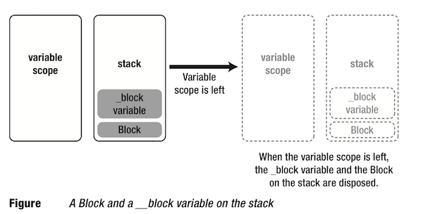

### block的定义
#### 块字面量
--- 
块字面量的定义，没有名称，所以有时我们也叫*匿名函数*

	^(argument_list){};
	
	^(int n) {return  2 * n;};

#### 块指针定义
---
块指针的定义，跟函数指针的定义几乎相同，只是把函数的的指针`*`改成了块特有的`^`

	return_type (^name)(list of argument types);
	
	int (^doubler)(int a);
	
#### 块对外部参数的访问权限
* 对其封闭作用域中可见的`自动变量`的只读访问权限
* 对`函数`或者`方法`中声明的`静态变量`的读 / 写访问权限
* 对`外部变量`(即全局变量)的读 / 写访问权限
* 对声明为`块变量`的特殊变量的读 / 写访问权限

#### 块变量 
---
所谓块变量，即：使用__block修饰的变量。
快变量被其定义域中定义的任何共块享，在一个块变量的作用域中定义的任何块都可以读写那个变量。

	__block int j = 10;
	void (^blockPtr_1)(void) = ^(void){ j += 15; };
	void (^blockPtr_2)(void) = ^(void){ j += 25; };
	
	blockPtr_1();		// j 25
	blockPtr_2();		// j 50
跟其他自动变量一样，块变量一开始是在栈上分配的。但是如果复制一个引用块变量的块，就会把块变量与块一起从栈上移到堆上。

### block结构体信息
---
**main.m代码**

	int main(int argc, const char * argv[]) {
    	int i = 12;
	    void (^tempBlock)(void) = ^{
	    	printf("tempBlock string %zd\n", i);
   		 };
    	tempBlock();
    	return 0;
	}

想要了解block的结构组成，我们需要借助clang 工具重编译上面代码。我们可以粗浅的认为，block是怎么构建和实现的。实际上 clang 根本不会将 block 转换成人类可读的代码，它对 block 到底做了什么，谁也不知道。不要把C++编译的block当成是实际实现。

将main.m文件用clang工具翻译成main.cpp

	clang -rewrite-objc main.m

**main.cpp代码片段**

<pre><code>
// block 实现的结构体
struct __block_impl {
    void *isa;      // 实例对象
    int Flags;      // 按位承载block 的附加信息
    int Reserved;   // 保留变量
    void *FuncPtr;  // 函数指针，指向Block 要执行的函数
};

// block 实现的结构体，也是block 实现的入口
struct __main_block_impl_0 {
    
    struct __block_impl impl;           // block 实现的结构体变量
    struct __main_block_desc_0* Desc;   // 描述block 的结构体变量
    int i;
    // __main_block_impl_0              // 结构体的构造函数，初始化 impl 和 Desc
    // 每一个类型的Block 他们的构造函数是不同的,捕捉的外部变量不同
    __main_block_impl_0(void *fp, struct __main_block_desc_0 *desc, int _i, int flags=0) : i(_i) {
        impl.isa = &_NSConcreteStackBlock;
        impl.Flags = flags;
        impl.FuncPtr = fp;
        Desc = desc;
    }
};

// bolck 实现函数 这个函数的返回值对应block的返回值，代码即:block的实现
static void __main_block_func_0(struct __main_block_impl_0 *__cself) {
    int i = __cself->i; // bound by copy
    
    printf("tempBlock string %zd\n", i);
}

// block 描述信息结构体
static struct __main_block_desc_0 {
    size_t reserved;               // 结构体信息保留字段
    size_t Block_size;             // 结构体大小
} __main_block_desc_0_DATA = { 0, sizeof(struct __main_block_impl_0)};

int main(int argc, const char * argv[]) {
    int i = 12;
    void (*tempBlock)(void) = ((void (*)())&__main_block_impl_0((void *)__main_block_func_0, &__main_block_desc_0_DATA, i));
    ((void (*)(__block_impl *))((__block_impl *)tempBlock)->FuncPtr)((__block_impl *)tempBlock);
    
    return 0;
}
</code></pre>

### block 实现的执行流程

### block 总共有几种形式
---
从`__block_impl`里面有一个指向实例对象isa指针看出，block 本身也是一个 Objective-C 对象。block 的三种类型：`_NSConcreteStackBlock`、`_NSConcreteGlobalBlock`、`_NSConcreteMallocBlock`，即当代码执行时，isa 有三种值

	impl.isa = &_NSConcreteStackBlock; 
	impl.isa = &_NSConcreteMallocBlock; 
	impl.isa = &_NSConcreteGlobalBlock;

### block 是基于栈的

前文中，已经提到了block的三种类型 `_NSConcreteStackBlock`、`_NSConcreteGlobalBlock`、`_NSConcreteMallocBlock`，见名知意，可以看出三种block在内存中的分布

在函数或方法内定义块字面量时，编译器将在栈上创建一个结构，保存块应用的任何局部变量的值的私有副本、它所引用的读/写变量的地址，以及一个指向块的可执行代码的指针。

块结构是在栈上创建的，但是块的可执行代码没有位于栈上。它与所有其他的可执行代码一起位于程序的文本部分。

块具有与自动变量相同的生存期。当块字面量越出作用域时，它就是未定义的，就像越出作用域的自动变量一样。块字面量的作用域的定义方式与自动变量的作用域相同：如果块字面量是在函数中定义的，那么当函数返回时，它就会越出作用域。

#### _NSConcreteGlobalBlock
* 当block 字面量写在全局作用域时，即为`global block`
* 当block 字面量不获取任何外部参数时，即为`global block`

除了上面的两种情况，其他形式创建的block均为`stack block`。

**第一种情况**
	
	typedef int(^Block_double)(int a);
	static int index_b = 10;
	Block_double blk_temp = ^(int a) {
	    return a * index_b;
	};
	int main(int argc, const char * argv[]) {
	    blk_temp(3);
	    NSLog(@"%zd %@",blk_temp(3), [blk_temp class]);
	 }
	 
	 Block[4302:191075] 30 __NSGlobalBlock__

**第二种情况**

    Block_double blk = ^(int a) {
        return a * 2;
    };
    NSLog(@"%@", [blk class]);
    
    Block[4249:186900] __NSGlobalBlock__

**其他情况**

	int value = 3;       
    Block_double blk = ^(int a) {
        return a * value;
    };
    NSLog(@"%@", [blk class]);
    
    Block[4323:194241] __NSStackBlock__

`_NSConcreteGlobalBlock`类型的blcok 处于内存的ROData段，此处没有局部变量的骚扰，运行不依赖上下文，内存管理简单许多，下面讲到内存管理的时候会在解释。

#### _NSConcreteStackBlock
`_NSConcreteStackBlock`类型的block处于内存的栈区。`global block`由于处于data段，可以通过指针安全访问，但是`stack block`处在内存栈区，如果其变量作用域结束，这个block就被废弃，block上的__block变量也同样会被废弃。

为了解决这个问题，block提供了copy功能，将block和__block变量从栈拷贝到堆，拷贝之后`_NSConcreteStackBlock `的类型也会发生变化。就是下面要说的`_NSConcreteMallocBlock`

#### _NSConcreteMallocBlock
当一个`_NSConcreteStackBlock`类型的block从栈拷贝到堆后，当栈上变量作用域结束时，仍然可以继续使用block

此时，堆上的block类型已经是`_NSConcreteMallocBlock`
如果你细心的观察上面的转换的C++代码，你会发现访问结构体

### block __block修饰符的实现

按照之前规则。我们看下__block修饰的变量在C++下的实现

**__block修饰源码**

<pre><code>
int main(int argc, const char * argv[]) {
    __block int i = 12;
    
    void (^tempBlock)(void) = ^{
        i += 5;
    };
    tempBlock();
    
    printf("i = %zd", i);
    
    return 0;
}
</code></pre>

**clang 编译后的**

<pre><code>
// block 实现的结构体
struct __block_impl {
    void *isa;      // 实例对象
    int Flags;      // 按位承载block 的附加信息
    int Reserved;   // 保留变量
    void *FuncPtr;  // 函数指针，指向Block 要执行的函数
};

// block 修饰的外部变量
struct __Block_byref_i_0 {
    void *__isa;                        // 对象指针
    __Block_byref_i_0 *__forwarding;    // 指向自己的指针
    int __flags;                        // 标志位变量
    int __size;                         // 结构体大小
    int i;                              // 外部变量
};

// 函数: 当block从 栈 拷贝到 堆 时，调用此函数
extern "C" __declspec(dllexport) void _Block_object_assign(void *, const void *, const int);
// 函数: 当block从 堆内存 配置数据时，调用此函数
extern "C" __declspec(dllexport) void _Block_object_dispose(const void *, const int);

extern "C" void _Block_object_assign(void *, const void *, const int)
__attribute__((availability(macosx,introduced=10.6)));
extern "C" void _Block_object_dispose(const void *, const int)
__attribute__((availability(macosx,introduced=10.6)));

// block 实现的结构体，也是block 实现的入口
struct __main_block_impl_0 {
    
    struct __block_impl impl;           // block 实现的结构体变量
    struct __main_block_desc_0* Desc;   // 描述block 的结构体变量
    __Block_byref_i_0 *i;               // by ref
    
    // __main_block_impl_0              // 结构体的构造函数，初始化 impl 和 Desc i
    __main_block_impl_0(void *fp, struct __main_block_desc_0 *desc, __Block_byref_i_0 *_i, int flags=0) : i(_i->__forwarding) {
        impl.isa = &_NSConcreteStackBlock;
        impl.Flags = flags;
        impl.FuncPtr = fp;
        Desc = desc;
    }
};

// bolck 实现函数
static void __main_block_func_0(struct __main_block_impl_0 *__cself) {
    __Block_byref_i_0 *i = __cself->i; // bound by ref
    
    (i->__forwarding->i) += 5;
}

// block 复制参数
static void __main_block_copy_0(struct __main_block_impl_0*dst, struct __main_block_impl_0*src) {_Block_object_assign((void*)&dst->i, (void*)src->i, 8/*BLOCK_FIELD_IS_BYREF*/);}

static void __main_block_dispose_0(struct __main_block_impl_0*src) {_Block_object_dispose((void*)src->i, 8/*BLOCK_FIELD_IS_BYREF*/);}

// block 描述信息结构体
static struct __main_block_desc_0 {
    size_t reserved;               // 结构体信息保留字段
    size_t Block_size;             // 结构体大小
    void (*copy)(struct __main_block_impl_0*, struct __main_block_impl_0*);
    void (*dispose)(struct __main_block_impl_0*);
} __main_block_desc_0_DATA = { 0, sizeof(struct __main_block_impl_0), __main_block_copy_0, __main_block_dispose_0};

int main(int argc, const char * argv[]) {
    __attribute__((__blocks__(byref))) __Block_byref_i_0 i = {(void*)0,(__Block_byref_i_0 *)&i, 0, sizeof(__Block_byref_i_0), 12};
    
    void (*tempBlock)(void) = ((void (*)())&__main_block_impl_0((void *)__main_block_func_0, &__main_block_desc_0_DATA, (__Block_byref_i_0 *)&i, 570425344));
    
    ((void (*)(__block_impl *))((__block_impl *)tempBlock)->FuncPtr)((__block_impl *)tempBlock);
    
    printf("i = %zd", (i.__forwarding->i));
    
    return 0;
}
</code></pre>

加了__block修饰以后，代码量增加了不少，

* `__Block_byref_i_0`结构体：用于封装__block修饰的外部变量
* `_Block_object_assign`函数：当block从栈拷贝到堆时，调用
* `_Block_object_dispose`函数：当block从堆内存释放时，调用

OC源码中的`__block int i` 翻译后变成了`__Block_byref_i_0`结构体，在block捕获外部变量的时候，构造函数初始化使用的是`__Block_byref_i_0`指针传递的。

另外在`__Block_byref_i_0`结构体中有一个指向自己的指针`__forwarding`，在block的实现函数中，获取外部变量的值是通过`__forwarding->i`获取i的值的。这样做的原因是，因为在block被copy到堆上的时候，`__forwarding`的指针就指向了堆区的结构体，这样在栈区`__block`变量出了作用域，后面在想使用`__block`修饰的变量，只要通过`__forwarding`访问堆上的变量就行了，而不会出现程序崩溃的现象了。

### block copy的内存管理
### block ARC下的内存管理
### block MRC下的内存管理

### block 应该注意的事项
##### 块变量在MRC下 
* 块变量修饰的是：自动变量
* 块变量修饰的是：局部静态变量、全局静态变量、全局变量

##### 块变量在ARC下
* 块变量修饰的是：自动变量
* 块变量修饰的是：局部静态变量、全局静态变量、全局变量